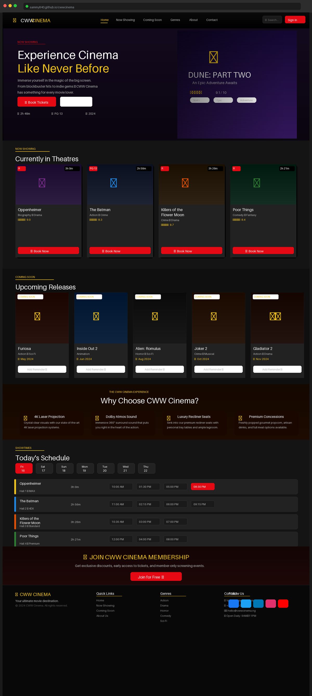

# 🎬 CWW Cinema — Movie Theatre Website

> A fully responsive, cinematic movie theatre website built with pure HTML, CSS & JavaScript — featuring a hero showcase, now-showing listings, coming-soon previews, a real-time showtime schedule, and a membership section. No frameworks, no dependencies — just clean, handcrafted frontend code.

[](https://developer.mozilla.org/en-US/docs/Web/HTML)
[](https://developer.mozilla.org/en-US/docs/Web/CSS)
[](https://developer.mozilla.org/en-US/docs/Web/JavaScript)

---

## 📸 Preview



---

## ✨ Features

- **Cinematic Hero Section** — full-width featured movie banner with title, rating, genre tags, and CTA buttons
- **Now Showing** — responsive movie card grid displaying currently screening films with ratings, certification badges, duration, and a "Book Now" button
- **Coming Soon** — upcoming release cards with release dates and "Add Reminder" actions
- **Showtimes Schedule** — day-by-day showtime table per movie with hall info and selectable time slots
- **Cinema Experience Section** — highlights premium features (4K Projection, Dolby Atmos, Recliner Seats, Concessions)
- **Membership Banner** — call-to-action section for joining the cinema loyalty programme
- **Responsive Navigation** — sticky navbar with smooth-scroll anchor links and a sign-in button
- **Footer** — quick links, genre categories, contact info, and social media links
- **Fully Responsive** — adapts seamlessly across mobile, tablet, and desktop viewports

---

## 🛠️ Built With

| Technology | Role |
|---|---|
| **HTML5** | Semantic page structure and content |
| **CSS3** | Styling, layout (Flexbox/Grid), animations, and responsive design |
| **JavaScript** | DOM interactivity, date picker, active states, and dynamic UI behaviour |

No external libraries, frameworks, or package managers required — runs directly in the browser.

---

## 🗂️ Project Structure

```
cwwcinema/
├── index.html       # Main HTML page — all sections and content
├── style.css        # All styling, layout, and responsive breakpoints
├── main.js          # JavaScript for interactivity and dynamic behaviour
└── img/             # Movie posters, icons, and media assets
```

---

## 📄 Page Sections

| Section | Description |
|---|---|
| **Navbar** | Logo, navigation links, search bar, and sign-in button |
| **Hero** | Full-width featured film banner with booking CTA |
| **Now Showing** | Grid of currently screening movies with ratings and booking |
| **Coming Soon** | Upcoming films with release dates and reminder option |
| **Cinema Experience** | Feature highlights — projection, sound, seating, food |
| **Showtimes** | Date picker + per-movie schedule with hall and time slots |
| **Membership** | Loyalty programme CTA banner |
| **Footer** | Links, contact details, social media icons |

---

## 🚀 Getting Started

No installation needed. Simply clone and open in your browser:

```bash
# 1. Clone the repository
git clone https://github.com/Sammy840/cwwcinema.git

# 2. Navigate into the project folder
cd cwwcinema

# 3. Open in browser
open index.html
```

> Or right-click `index.html` and choose **"Open with Live Server"** in VS Code for hot-reloading during development.

---

## 📱 Responsive Design

The site is fully responsive and tested across the following breakpoints:

| Device | Breakpoint |
|---|---|
| Mobile | < 480px |
| Tablet | 481px – 768px |
| Laptop | 769px – 1200px |
| Desktop | > 1200px |

---

## 📬 Author

**Oluwaseun Samuel** — Frontend Developer

| | |
|--|--|
| 🌐 Portfolio | [sammy840.github.io/port.github.io](https://sammy840.github.io/port.github.io/) |
| 📧 Email | samoluwaseun2016@gmail.com |
| 💼 LinkedIn | [oluwaseun-ogunbayo](https://www.linkedin.com/in/oluwaseun-ogunbayo-7b7973197) |
| 🐦 Twitter | [@webbidox](https://twitter.com/webbidox/) |
| 📍 Location | Benin City, Edo State, Nigeria |

---

## 📄 License

This project is open source and available under the [MIT License](LICENSE).

---

<p align="center">
  Made with ❤️ and vanilla HTML/CSS/JS by <strong>Oluwaseun Samuel</strong>
</p>
